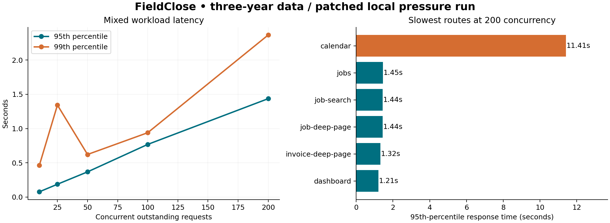

# FieldClose — three-year simulation and pressure test

**Result:** the tested core workflows retained correct balances and tenant boundaries under the modeled workload. A financial-role access defect was found, corrected and retested. The calendar remains a performance hotspot during extreme bursts. This is evidence for controlled daily use, not certification of unattended operation or hosted capacity.

## What was modeled

- 10 companies, 100 signed-in employees: 10 owners, 10 dispatchers, 80 technicians.
- September 27, 2023–September 26, 2026; 250 operating days/year; three visits per technician/day.
- 180,000 historical jobs plus 100 separate current-work fixtures; 20,000 customers; 180,000 estimates; 162,000 invoices; 149,540 historical payments; 540,000 activity events.
- **1,735,850 seeded records**, occupying **454.4 MiB** before live workload additions. Amounts and customers are fictional.
- Apple M4 Pro, 24 GiB RAM, PostgreSQL 17.10, 20 application database connections; app, database and load generator share the machine.

## Executed checks

**83,522 actual HTTP requests** across original and corrected runs (42,251 original; 41,271 corrected). Both runs signed in all 100 employees with real Auth.js. Each run created 100 jobs and invoices through actual server actions and delivered 500 locally signed settlement notifications for 100 invoices, followed by 100 late failure notifications. Each invoice retained exactly one successful payment and zero outstanding balance. These were synthetic callback tests; Stripe was never called.

All **370 company/month checks** matched seven independently generated financial/workload expectations. Eight database invariants found no monetary, document-number or tenant-link violations. The actual recurring engine advanced 100 plans through 36 dates with four overlapping runs plus a repeat at each date, producing exactly **2,190 maintenance visits** with correct membership counts.

The corrected run passed **9/9 workflow/security checks**, with **0 server errors/timeouts**, **0 unexpected responses**, and **0 cross-company marker leaks**. Company reads/writes, technician assignment boundaries, role-gated financial data, and complete owner exports were checked. Marker checks supplement explicit 404/403 assertions; they do not establish coverage of every route.

## Response times — corrected application

P95 means 95% of requests completed within that time. Timings include localhost HTTP and server work, not a human browser's rendering or internet latency. Bursts have no think time. The sustained phase uses 100 users, 500 ms think time and lasts 120 seconds. This is a closed-loop generator: slow requests reduce offered throughput.

| Phase | Concurrency | Requests | Requests/sec | P95 | P99 | Maximum | Unexpected failures |
|---|---:|---:|---:|---:|---:|---:|---:|
| warmup | 10 | 365 | 35.6 | 0.062s | 0.077s | 0.090s | 0 |
| burst-10 | 10 | 4,321 | 215.8 | 0.077s | 0.464s | 0.633s | 0 |
| burst-25 | 25 | 4,403 | 219.9 | 0.188s | 1.343s | 1.448s | 0 |
| burst-50 | 50 | 4,546 | 225.8 | 0.368s | 0.622s | 2.936s | 0 |
| burst-100 | 100 | 4,435 | 221.0 | 0.769s | 0.939s | 6.115s | 0 |
| burst-200 | 200 | 4,624 | 229.6 | 1.436s | 2.364s | 11.683s | 0 |
| sustained-100 | 100 | 16,358 | 135.5 | 0.502s | 0.593s | 0.796s | 0 |
| recovery-10 | 10 | 739 | 36.6 | 0.046s | 0.065s | 0.081s | 0 |

At sustained 100-user load, P95 was **0.502s** and throughput **135.5 requests/sec**. Recovery P95 was **0.046s**. Peak measured application RSS was **1406 MiB**. Median RSS over the first/last approximately 20 seconds of the sustained phase was **1386/1119 MiB**; a two-minute observation cannot rule out a long-running memory leak.

## Findings and actions

1. **High — financial access:** all 90 non-pricing employees could read company-wide financial analytics through the JSON endpoint in the original build. The financial screens already restricted them. The API now enforces the same pricing capability and private/no-store responses. All 90 were denied in the corrected HTTP run; nine regression cases and the full 1,427-test unit suite passed. This was within-company role exposure, not a cross-company breach. The test does not establish whether any real user exploited it.
2. **Performance — crowded calendar:** the slowest 200-concurrency route was **calendar**, P95 **11.41s**. Overall averages hide this tail. Profile server rendering and query waits on a production-like staging environment; bound the number of rendered jobs per day and retain a drill-down to the complete list. Do not claim an indexing change alone will fix rendering or queueing delays.
3. **Harness correction:** the original runner incorrectly marked **3,495 expected technician dashboard redirects** as failures. These are retained in raw data and explicitly reclassified, not hidden. The corrected journey goes directly to the technician field view. There were **0 other unexpected baseline failures** after separating the **90 real financial-access violations**. Four initial trade-profile fixture slugs were also normalized before the corrected run.
4. **Capacity boundary:** this local test showed no server errors at up to 200 outstanding requests. It does not identify the hosted breaking point or guarantee a number of paying companies. Run a bounded staging test with the actual production hosting/database tiers, realistic WAN latency, external-service failure injection and a multi-hour soak before making capacity promises.

Quiet, warm-cache database probes after the run measured the owner calendar query at 1.724 ms (485 rows), technician calendar at 0.535 ms (60 rows), and document-number allocation at 11.766 ms. These are not concurrent timings. They suggest profiling server rendering and queueing as well as database contention; they do not prove the cause of the 11-second HTTP tail. Full query plans are included.

## Limits and next priorities

Historical records were bulk-generated; they were not 180,000 end-to-end browser journeys. Calendar-month analytics and the recurring engine were executed separately. The accelerated recurring clock does not age every application component or browser token. External email, photo blobs/storage, physical readers, real payments/payouts, internet failures, serverless cold starts and production cron invocation are outside this simulation. No real customer was contacted and no real money moved. Pressure was applied only to the isolated local database/application. The test database is retained for inspection, and temporary app processes are stopped after each run.

The next performance priority is the crowded calendar. The next confidence priority is hosted staging plus longer-duration and provider-failure testing. The permissions fix (139de1a) is published as deployment dpl_BQRjQ3wwSJmmsutkpatewjRRTk97. Candidate and public checks each passed 24 routes plus eight metadata/access checks. Exact public alias/revision binding and database health were verified after promotion. These light public checks are separate from the local load experiment.

## Reproducibility and data

Application under test: `139de1a57a64b6de0612399037e230d943ec6ca7`; original runtime: `06b5b7b74caaf965115f60cf36884314c4c90935`. Corrected build: `rd0z4QYxctbsVwkRb9A1y`. The repository's `scripts/stress/README.md` documents execution, safeguards and workload details.

Raw per-request CSV, phase summaries, JSON receipts, historical expectations, invariant checks and charts are included alongside this report. Credentials, login cookies and signing secrets were held only in memory and are not included.
